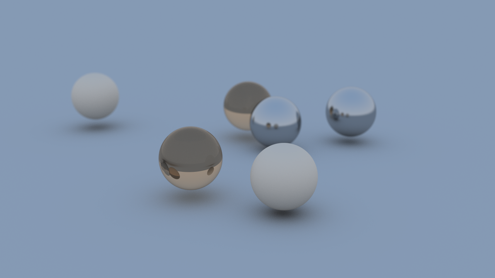

# RayTracerJava

&nbsp;&nbsp;&nbsp;&nbsp;In 3D computer graphics, ray tracing is a rendering technique for generating an image by tracing the path of light as pixels in an image plane and simulating the effects of its encounters with virtual objects.

The technique is capable of producing a high degree of visual realism, more so than typical scanline rendering methods, but at a greater computational cost.

-- <cite>https://en.wikipedia.org/wiki/Ray_tracing_(graphics)

## Project 
&nbsp;&nbsp;&nbsp;&nbsp;My application is a ray tracer program that generates an image of three spheres of varying materials. I used Java generics and recursion in creating the application. 
I needed a way to return multiple classes, so I created a Pair generic class that holds two classes. I used the concept of recursion in sampling each pixel from each ray cast. 
Basic polymorphism was used in creating materials and shapes. This allowed the calling of virtual functions when testing ray intersections and material appearance.
I tried using functional programming by using parallelStreams to thread the intersection testing code. The overhead of using parallelStreams made the program quite a bit slower.
Bounding volume hierarchies and threading can be the next step in getting better render performance. Eventually this can be moved to the GPU for even faster acceleration.

## Result
   

## Building and Running

Tested with Windows and Linux using:

- Java JDK 16
- Gradle
- IntelliJ IDEA Community 2021

Import the gradle project into IDEA. Build the project and run module SimpleRT. The output image will be output.bmp in the root project folder.

## Testing

To test the project, build the test module and run the unit tests.

## Documentation
To generate documentation with javadocs, go to Tools > "Generate Javadocs...". Documentation should already be generated and is located in the docs folder.